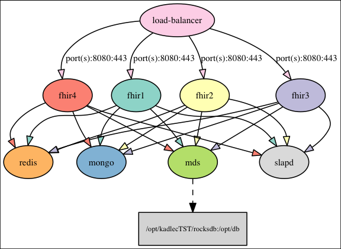

docker scriptz
--

I've started to play with docker, so I thought I'd toss down a script or
three as I do some things. Right now only one lonely one.

consume-compose.py
--

A little program to take a docker compose file and try to map out
the connections between the various pieces. Right now it tries to
map out -

    links
    external_links
    volumes
    ports

And output .dot format (it requires the graphviz dot program to create
image files.) Sample image is near the bottom of this page.

I tossed this together and then looked around; there are other things
that might suit some better, like at https://github.com/funkwerk/compose_plantuml,
and https://github.com/Alexis-benoist/draw-compose; probably there
are others. But I wasn't getting what I personally wanted from their
more advanced packages, so I thought I'd put this out there... just
because, I guess. If anyone knows of something that works even better
I'm happy to toss this, let me know!

Mine is super simplistic and probably won't work on a compose file
that uses advanced features or beyond my comprehension. But I've
found it very helpful just to get a handle on what an app does when
someone hands me a bunch of code.

You can run it like:

    # generate dot format - docker-compose.yml is simply a sample YAML file
    consumer-compose.py docker-compose.yml > docker.dot
    
    # create a PNG using the output of the above
    dot -Tpng -o docker.png < docker.dot

    # or, force it to approximately some size desired with the Dsize arg.
    dot -Gsize=6,6\! -Tpng -o compose.png < compose.dot

And that'll create a PNG called docker.png (SVGs and other formats
are possible as well, just change the dot command.)

Given the included compose file, the output looks like -

Containers are circular, volumes are boxes, external things (e.g.
ports open to the outside) are red, and networks are double-lined
circles ('cuz I've never actually seen one in action, but they're
probably important ;))

This requires the "dot" command to actually create any graphical
output as well as the pygraphviz and docker compose libs (e.g. "pip
install pygraphviz docker-compose".)

